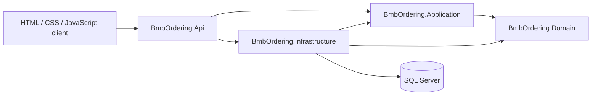
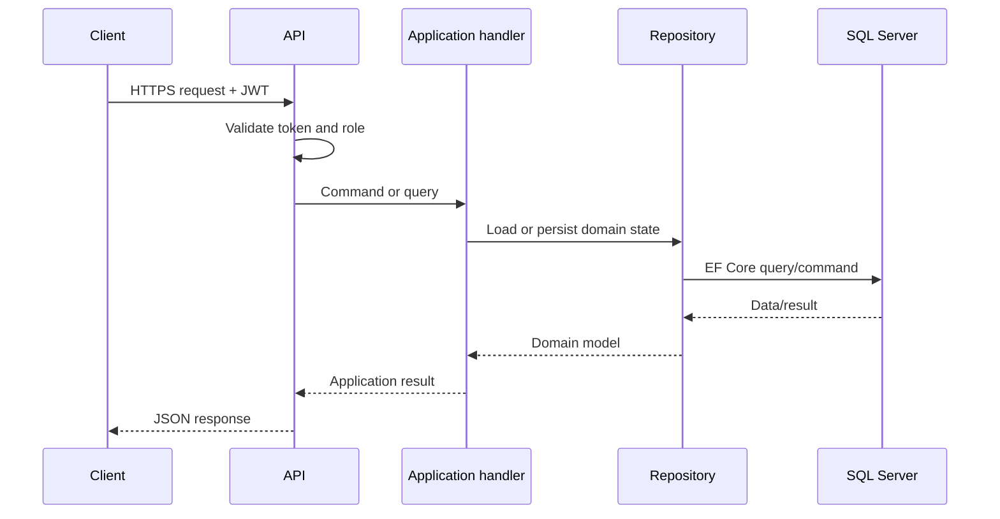
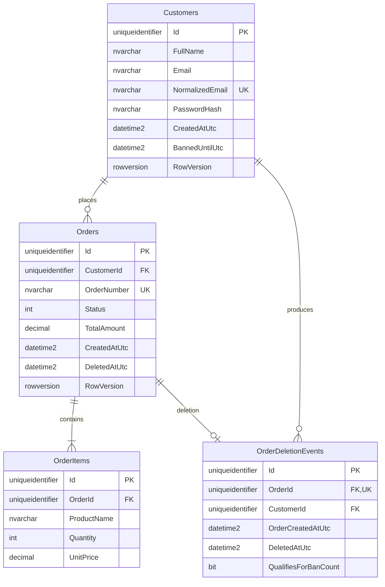

# Architecture

## Overview

The BMB Ordering System uses Clean Architecture to keep business rules independent from ASP.NET Core, Entity Framework Core, SQL Server, and the browser client.

Dependencies point inward. Domain and Application do not depend on Infrastructure or API implementation details.

## Projects

### BmbOrdering.Domain

Contains the core model and invariants:

- `Customer`: registration state and six-hour ordering ban behavior.
- `Order`: order creation, total calculation, and soft deletion.
- `OrderItem`: item validation and line-total calculation.
- `OrderDeletionEvent`: immutable audit information and qualification decision.
- `OrderStatus`: order lifecycle state.
- `DomainException`: business-rule violation type.

Entities expose private setters and controlled factory or behavior methods so callers cannot construct invalid states.

### BmbOrdering.Application

Contains use cases and ports:

- Authentication registration and login handlers.
- Order create, retrieve, list, and delete handlers.
- Administrator customer and order query handlers.
- Input validators and application exceptions.
- Repository, transaction, time, token, password, and user-context abstractions.

Application handlers depend on interfaces. They do not know whether persistence uses SQL Server or whether the caller is an HTTP controller.

### BmbOrdering.Infrastructure

Provides adapters for Application abstractions:

- EF Core `OrderingDbContext`.
- SQL Server entity configurations and migrations.
- Customer, order, and deletion-event repositories.
- Serializable transaction execution.
- ASP.NET Core password hashing.
- JWT generation.
- Configuration-based role assignment.
- System UTC clock.

### BmbOrdering.Api

Acts as the composition and delivery layer:

- REST controllers and request/response contracts.
- JWT validation and role authorization.
- Current-user claim mapping.
- Central exception-to-Problem-Details middleware.
- Swagger in Development.
- Static HTML/CSS/JavaScript client under `wwwroot`.
- Dependency registration in `Program.cs`.

## Request flow

## Deletion and banning workflow

The critical deletion use case executes with serializable isolation:

1. Resolve the authenticated customer ID from JWT claims.
2. Load the customer and owned active order.
3. reject an existing deletion event.
4. Soft-delete the order.
5. Record an `OrderDeletionEvent`.
6. Count qualifying deletions within the current UTC day.
7. Apply a six-hour ban when the count reaches three.
8. Commit the transaction.

A deletion qualifies only when `Order.CreatedAtUtc.Date` equals `DeletedAtUtc.Date`. The application uses `IClock`, making time-dependent behavior deterministic in tests.

## Database model

Important indexes include:

- Unique normalized customer email.
- Unique order number.
- Unique deletion event per order.
- Customer and creation time for order queries.
- Customer, qualification flag, and deletion time for ban counting.

`rowversion` columns protect Customer and Order updates from silent concurrent overwrites. Deleted orders are retained and excluded from ordinary customer queries through an EF Core query filter. Administrator queries explicitly include them.

## Security boundaries

- Registration and login are anonymous.
- Order controllers require the `Customer` role.
- Cross-customer order access returns `404 Not Found` rather than disclosing ownership.
- Administrative operations require the `Administrator` role.
- Customer ID is read from validated JWT claims, never from an order request body.
- Passwords are hashed through ASP.NET Core's password hasher.
- Signing keys and database credentials are external configuration.

## Automated enforcement

The architecture test project prevents accidental erosion by checking:

- Exact project-reference direction.
- Compiled assembly dependencies.
- Domain encapsulation.
- Sealed handlers, entities, repositories, and controllers.
- Application abstraction naming.
- Explicit authorization on every controller.
- Administrator-role protection on administrator endpoints.
